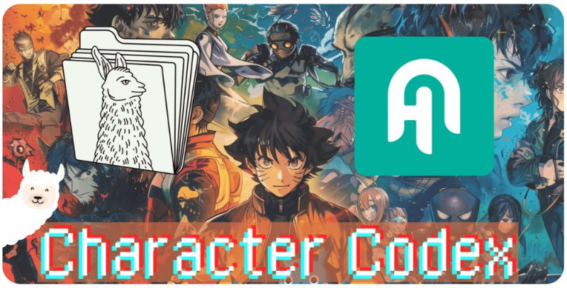

+++
title = "🌌 Creating adventures with local LLMs"
date = "2024-06-24"
description = "Make LLMs simulate adventures with llamafile + Character Codex."

[taxonomies]
tags = ["Tutorials", "LLM", "llamafile", "Haystack", "role-playing"]
+++

What if 🤔... Homer Simpson met Spider-Man and they went on a quest for donuts? 🍩

Or if Fred Astaire and Corporal Hicks teamed up to fight xenomorphs? 👾

In the words of Karpathy, LLMs are dream machines...
they seem specially made to simulate these wild scenarios!

**Experimenting with this idea 👇**

Nous Research/teknium recently released [Character Codex](https://huggingface.co/datasets/NousResearch/CharacterCodex):
a massive dataset with information on 16k characters, both fictional and real.
I couldn't wait to play it...

After a few attempts, I found that combining the information in this dataset with a good model (like Llama-3-8B)
opens the doors to a myriad of chat adventures.

🛠️ Stack:
- Haystack for orchestration 🏗️
- llamafile 🦙🗂️ (by Mozilla) to run our model locally.

**Check out the [📓 notebook](https://haystack.deepset.ai/cookbook/charactercodex_llamafile)**
(includes a bonus 🕵️ Mystery Character Quiz)

