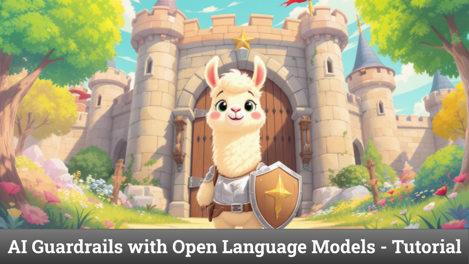

+++
title = "🛡️ AI Guardrails with Open Language Models"
date = "2025-07-03"
description = "Learn how to implement Content Moderation and Safety with Open Language Models"

[taxonomies]
tags = ["Tutorials", "LLM", "Haystack", "RAG", "safety"]
+++

Here is a tutorial on how to implement Content Moderation and Safety with Open Language Models.

[📓 Notebook](https://haystack.deepset.ai/cookbook/safety_moderation_open_lms)

For a short intro, read on!


How do you ensure your AI application is safe from harmful or inappropriate user inputs?

This is a core requirement for real-world AI deployments. Luckily, several open Language Models are built specifically for safety moderation.

I've been exploring them and put together a hands-on tutorial using the Haystack framework to build your own AI guardrails.

In the [notebook](https://haystack.deepset.ai/cookbook/safety_moderation_open_lms), you'll learn how to use and customize:
- Meta Llama Guard (via Hugging Face API)
- Google ShieldGemma (via Ollama)
- IBM Granite Guardian (via Ollama), which can also evaluate RAG specific risk dimensions
- NVIDIA NemoGuard models family, including a model for topic control

You'll also see how to integrate content moderation into a 🔎 RAG pipeline.

