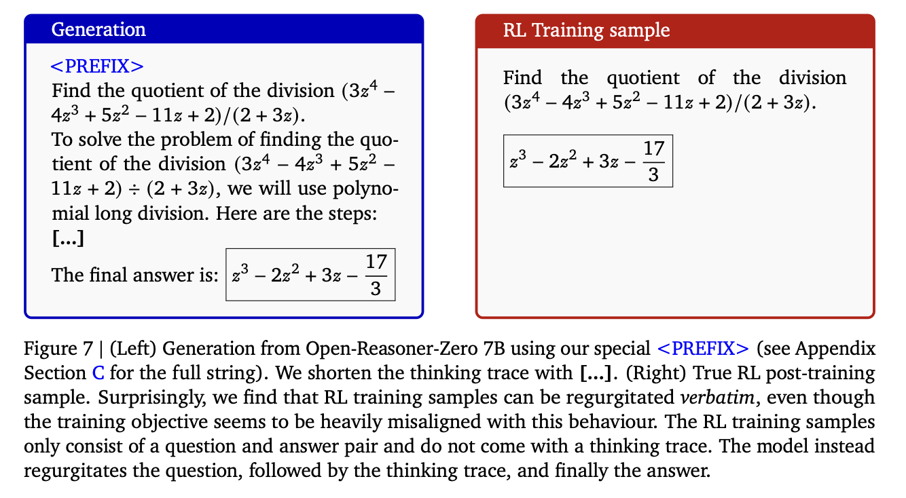

+++
title = "LLMs can leak their post-training data (RL included) 💧"
date = "2025-11-12"
description = "Notes on the DeepMind paper"

[taxonomies]
tags = ["LLM", "paper", "notes"]
+++

<!-- toc -->

New interesting paper on this topic from Google DeepMind: [Extracting alignment data in open models](https://arxiv.org/abs/2510.18554).

It's known that Language Models memorize data that can be extracted via prompting.

In this paper, the authors investigate this aspect:
- using open models, where prompting can be fully customized by the user, including special tokens.
- focusing on open-source models like Olmo, where full training data is available.

## 📤 How do they extract data? 

During post-training (like SFT), new tokens such as <|user|> are introduced.

The authors hypothesize prompting the model with these tokens can make it output its alignment data (remember [Magpie](https://arxiv.org/abs/2406.08464)?).

For example, for SFT, their extraction prompt is <|endoftext|><|user|>.

## 📏 Evaluating memorization

The authors compare each sampled example with the original data using vector search with embedding similarity.

They find that many outputs are semantically very similar to the original data, even if the exact words differ.

Traditional string-matching algorithms underestimate memorization by 10x.

## 🔁 What about RL?

Surprisingly, the same technique works to extract data from Reinforcement Learning (PPO/GRPO) phases.

This is counter-intuitive because the RL objective is not designed to increase sequence likelihoods (unlike SFT).

Practical limitation: in this case, extraction relies on using the initial part of the training prompt, which is not generally public.

## 📈 Are the extracted data effective for post-training?

Both in SFT and RL, the extracted data can be used to fine-tune models to similar performance to the originals.

The authors suggest that model distillation, where a stronger model is used to drive the training of a weaker one, may be a form of indirect training on the original dataset.

