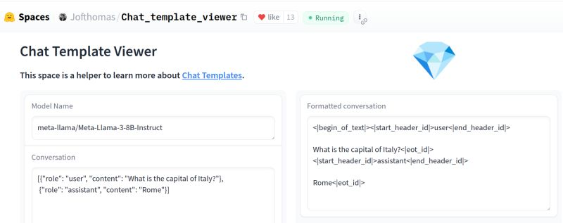

+++
title = "🧰 From my toolbox: 💬 Chat Template Viewer"
date = "2024-10-07"

[taxonomies]
tags = ["LLM", "Chat template"]
+++

When you interact with a Language Model, it's typically through a Messages API, like this:

```JSON
[{"role": "user", "content": "What is the capital of Italy?"},
 {"role": "assistant", "content": "Rome"}]
```

*But what's happening under the hood? How does it get translated into a prompt?*

Open models give us the ability to peek inside.

🦙 Llama 3 transforms messages into a format like:

`<|begin_of_text|><|start_header_id|>user<|end_header_id|>
What is the capital of Italy?<|eot_id|><|start_header_id|>assistant<|end_header_id|>
Rome<|eot_id|>`


Mistral does it a bit differently:

`<s>[INST]What is the capital of Italy?[/INST]Rome</s>`

---

*𝘞𝘩𝘺 𝘥𝘰𝘦𝘴 𝘵𝘩𝘪𝘴 𝘮𝘢𝘵𝘵𝘦𝘳?*

Knowing how these templates are structured helps with debugging (for AI engineers) and is critical when fine-tuning models.

🤗 Hugging Face did a great job unifying different chat formats, but manually inspecting Jinja templates isn't exactly fun.

That's why I often rely on a hidden gem: [💎 Chat Template Viewer by Joffrey THOMAS](https://huggingface.co/spaces/Jofthomas/Chat_template_viewer). 

It's a HF space that lets you 🕹️ interactively experiment with messages and see how they translate to a final prompt across different open models. 

