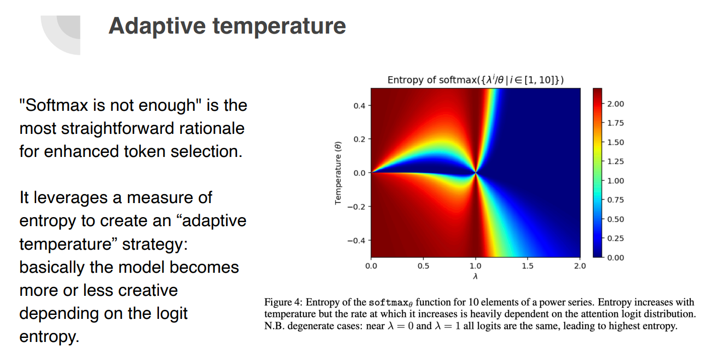

+++
title = "🔮 Decoding strategies and the future of Language Models"
date = "2024-11-12"
description = "An intro to classic and modern decoding/sampling strategies for LLMs"

[taxonomies]
tags = ["LLM", "decoding", "sampling", "entropix", "min-p"]
+++

<!-- toc -->

## Intro
The performance of a Generative Language Model depends not just on how it's trained, but also on *how inference is performed*.

OpenAI o1 model hints at this.
SmolLM2 + entropix (entropy based sampling) show impressive improvements in GSM8K.

How does inference work and how can we influence it?

## ⚙️ Basics of text generation

Most Generative Language Models are auto-regressive:
given an input text, they generate one token at a time, using the sequence so far to predict the next token until reaching a stopping criterion (e.g., specific token or max length).

But each time we feed a prompt into a Language Model, we actually get a list of logits (unnormalized confidence scores), one for each token in the model vocabulary. 

(Llama 3 vocabulary size is 128K tokens, while Gemma 2 is 256K.)

*How do we turn these logits into a token?*

## 🕰️ Deterministic strategies

The simplest method is greedy search: transform the logits into probabilities using softmax, select the token with the highest probability, and repeat.

Easy, right?

Picking the highest probability token each step can limit exploration of better sequences. 🤔

To address this, beam search generates multiple sequences and selects the most probable one.
Yet, for open-ended tasks, it often results in repetitive, generic texts.

## 🎲 Sampling strategies

To make text generation more human-like, we introduce some randomness. 🃏

In its simplest form, sampling means selecting the next token based on its probability (multinomial sampling).

Temperature plays a key role in controlling randomness. It scales logits before softmax, altering the sharpness of the output distribution:
- Higher temperatures produce a more uniform, random output.
- Lower temperature creates a sharper distribution, approaching greedy search predictability.

Top-K and Top-p sampling are also popular.

🍪 Patrick von Platen wrote a [classic practical guide on decoding strategies](https://huggingface.co/blog/how-to-generate).

## 🌀 The future of sampling: Entropy is all you need?

Recent projects and papers, like ["Softmax is Not Enough"](https://arxiv.org/abs/2410.01104), ["Min-p Sampling"](https://arxiv.org/abs/2407.01082), and [entropix](https://github.com/xjdr-alt/entropix), explore fresh approaches to sampling during inference.

- The common idea is to adjust token selection techniques/parameters during inference. For example, temperature can be dynamically adapted during generation.

- "Softmax is not enough" and entropix explore using entropy as a measure of model uncertainty. High entropy means more uncertainty (a wider range of viable token choices), while low entropy suggests confidence in a smaller set. 
This measure can guide generation tuning.

*It's a vast and fascinating landscape.*

🍪 For an intro to these recent techniques, check out the [great slide deck by Pierre-Carl Langlais](https://github.com/Pleias/Quest-Best-Tokens/blob/main/New%20physics%20of%20LLM.pdf).