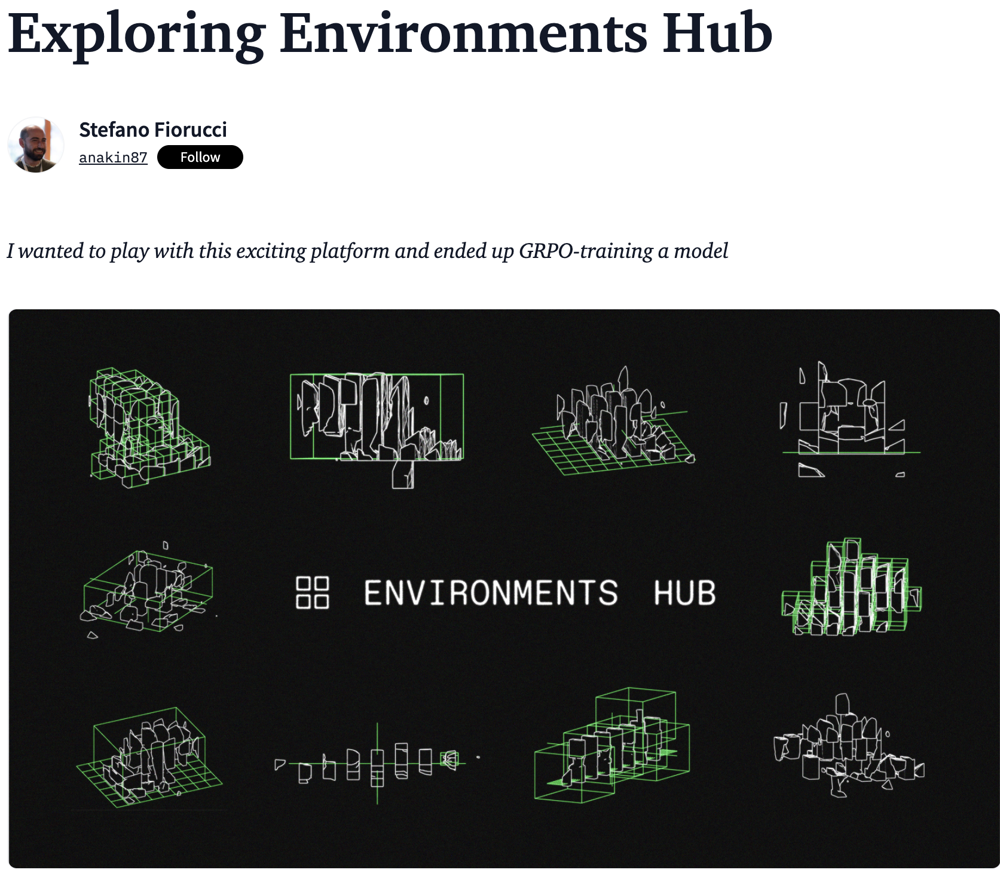

+++
title = "🌀 Exploring Environments Hub"
date = "2025-09-05"
description = "A practical intro guide to the Environments Hub by Prime Intellect"

[taxonomies]
tags = ["LLM", "GRPO", "Reinforcement Learning", "Tutorials", "post-training"]
+++

Reinforcement Learning for LLMs is too important to be locked away

When Prime Intellect released the Environments Hub, I couldn't wait to explore it.

It's a space where people can share RL environments: tasks you can use to train LLMs or evaluate Agents.

RL holds great promise to improve LLMs, but if progress stays in the hands of a few closed labs, open models could fall behind.
We would become just users of systems built with tools we can't access or fully understand.

The Environments Hub and the Verifiers library (William Brown) are part of an effort to change this trajectory and keep 
science and experimentation open. 🔬

---

I explored the Environments Hub and wrote a walkthrough 📝
- RL + LLMs basics
- Environments Hub navigation
- Evaluating models/Agents
- GRPO Training a tiny model on an alphabetical sort task

Take a look!
[📝 Blog post](https://huggingface.co/blog/anakin87/environments-hub)

