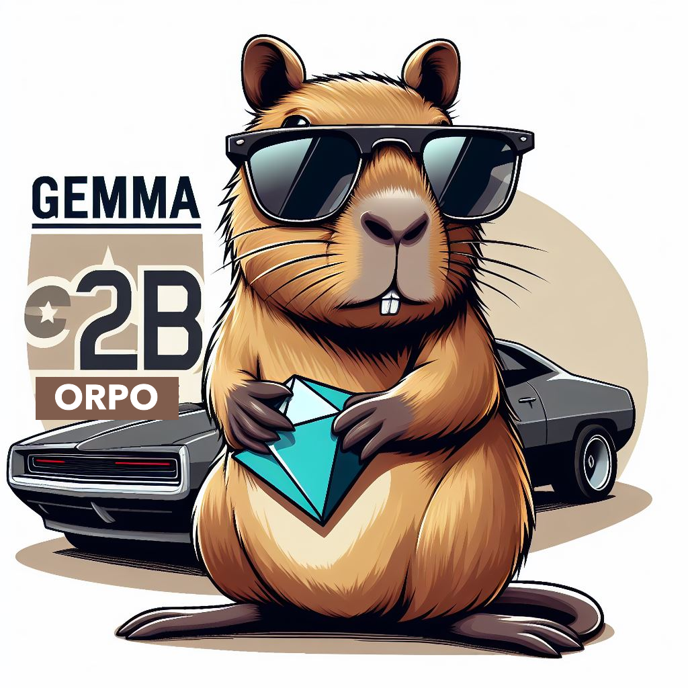

+++
title = "💎 gemma-2b-orpo: a Small Language Model trained with ORPO"
date = "2024-03-26"
description = "Learn how fine-tuned a Small Language Model, collapsing SFT+DPO into a single step with ORPO."

[taxonomies]
tags = ["Tutorials", "LLM", "Fine-tuning", "TRL", "ORPO", "Gemma", "post-training", "Haystack"]
+++


💻 You can find the Training code on **[this notebook](https://huggingface.co/anakin87/gemma-2b-orpo/blob/main/notebooks/training.ipynb)**.
For a short intro, read on!


<!-- toc -->

## Intro

Meet my weekend experiment: gemma-2b-orpo

👉 [Model](https://huggingface.co/anakin87/gemma-2b-orpo)

A Small Language Model trained from google/gemma-2b base model using ORPO.

## What is ORPO?

It stands for Odds Ratio Preference Optimization and is a new training paradigm for Language Models.

Typically, to obtain a helpful LM, you start with a pre-trained model, perform Supervised Fine-Tuning (SFT), and then Preference Alignment (with methods like RLHF or DPO). So far, these two steps have been necessary to achieve a model that follows instructions but is also aligned with human preferences.

ORPO collapses these two steps into one.

Working with preference data, this method introduces a penalty (based on log odds ratio) to the NLL loss function, to favor generations in the chosen response sets.

The first applications of ORPO show ⚡️ faster training, lower memory usage and good results!

## ☀️ My Small (weeekend) Language Model

- Started with gemma-2b base model
- Installed Hugging Face TRL from the main branch to use the new ORPOTrainer ✨
- Chose a good dataset: [dpo-mix-7k-simplified](https://huggingface.co/datasets/alvarobartt/dpo-mix-7k-simplified) by Álvaro Bartolomé del Canto and the Argilla friends
- Trained the model for 4 hours on an NVIDIA A40 GPU (<3$ on RunPod)

📊 The model performs well for its size, with good results on the Nous Research benchmark suite 🌞

## 📚 Resources
- [ORPO: Monolithic Preference Optimization without Reference Model](https://arxiv.org/abs/2403.07691)
- [gemma-2b-orpo Training notebook 📓](https://huggingface.co/anakin87/gemma-2b-orpo/blob/main/notebooks/training.ipynb)
- [gemma-2b-orpo Usage notebook (with the Haystack framework 💙)](https://huggingface.co/anakin87/gemma-2b-orpo/blob/main/notebooks/usage.ipynb)

