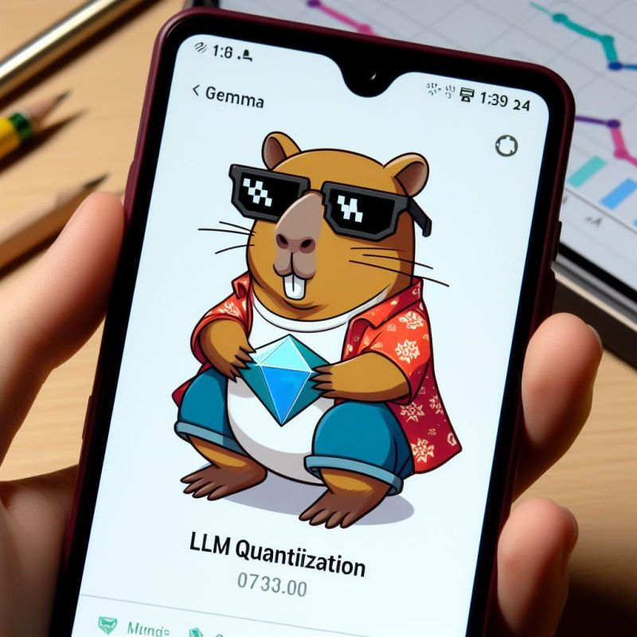

+++
title = "Quantization love 💙"
date = "2024-04-08"
description = "Notes on LLM Quantization."

[taxonomies]
tags = ["LLM", "Quantization", "GGUF", "Gemma", "notes"]
+++

<!-- toc -->

## Gemma 2B ORPO GGUF

I am happy to release a GGUF quantized version of [🦫💎 gemma-2b-orpo](../gemma-2b-orpo): my small Language Model trained with the ORPO paradigm.

You can run this model on a CPU-only machine, using less than 2 GB of RAM!

[🤗 Quantized Model](https://huggingface.co/anakin87/gemma-2b-orpo-GGUF)

Quantizing the original PyTorch model was fun, thanks to [this blog post by Benjamin Marie](https://kaitchup.substack.com/p/gguf-quantization-for-fast-and-memory).

## What is Quantization❓

In the context of Machine Learning models, quantization involves shrinking models to run efficiently on standard devices. 📱

Various techniques exist to transform models from their original numerical representations (FP32, FP16, BF16) to more compact forms.

The aim? To slash model memory usage without severely compromising inference quality.

## Crazy exciting times 🤯

The progress made in this field over the past 1.5 years has been stunning.

Thanks to the efforts of researchers and practitioners, a 7B language model that once required at least 15 GB of GPU VRAM can now run on a 5 GB GPU VRAM or even on a standard machine with 8 GB CPU RAM without significant quality loss.

Today, there are popular techniques such as NF4, GPTQ, AWQ, GGUF, and many other experimental ones.

Particularly, GGUF originated in ther experiment's Llama.cpp project and focuses on running LLMs on standard machines. It allows you to run an LLM on the CPU and offload some of its layers to the GPU (if available) to achieve higher speed.

## 🧑‍🏫 📖 Resources

To learn more about quantization, I found and recommend these excellent resources:

- [Beginner-friendly blog post by Maarten Grootendorst](https://www.maartengrootendorst.com/blog/quantization/)
- [Thorough series of articles by Maxime Labonne](https://mlabonne.github.io/blog/posts/Introduction_to_Weight_Quantization.html)

