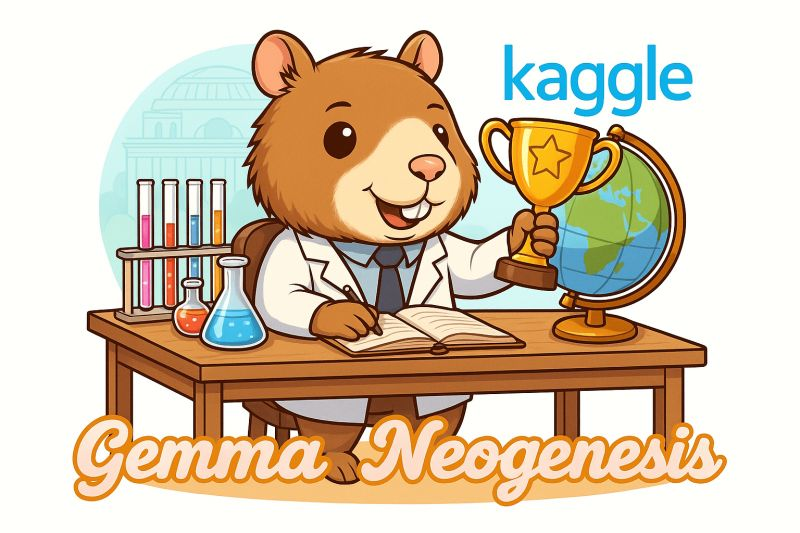

+++
title = "💎 I'm one of the winners of the Gemma fine-tuning competition! 🏆"
date = "2025-05-06"

[taxonomies]
tags = ["LLM", "post-training", "neogenesis", "Gemma", "Talk"]
+++


Resources:
- 📓 [Kaggle notebook](https://www.kaggle.com/code/anakin87/post-training-gemma-for-italian-and-beyond)
- 🤗 [Hugging Face collection](https://huggingface.co/collections/anakin87/gemma-neogenesis-67824b7bf13ac9cfe091fe2e)
- 🎬 [Project talk @ Pi School](https://www.youtube.com/watch?v=RFPp4ycQ0fA)


Unlock global communication with Gemma, a Kaggle competition organized by Google, invited participants to fine-tune Gemma 2 for a specific language or cultural context.

I prepared a cheap recipe to improve Gemma on a single language, combining:
- Synthetic data generation (with LLM-as-a-judge)
- Supervised Fine-Tuning
- Direct Preference Optimization
- Efficient training with Spectrum. 

I applied it to 🇮🇹 Italian, releasing new datasets and models.

🙏 Thanks to everyone who helped me:

- Daniel Vila Suero - for his suggestions about datasets
- Maziyar PANAHI - for tips on synthetic data generation via Hugging Face API 
- Maxime Labonne - for datasets and constant educational work 

- Edoardo Federici - for good Italian datasets
- Alessandro Ercolani and Samuele Colombo (mii-llm) - for running the Italian Open LLM Leaderboard
- Michele Montebovi - for being an example in crafting and sharing Italian models

- The folks at Hugging Face (Quentin Gallouédec, Lewis Tunstall, ...) - for maintaining TRL, a great LLM training library 
- Eric Hartford, Lucas Atkins, Fernando Fernandes Neto, and David Golchinfar - for creating Spectrum, a clever technique for module selection and memory-efficient training.

Thanks everyone, it's been fun!

