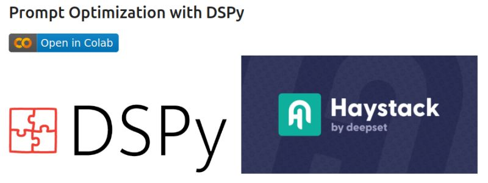

+++
title = "⚙️ Prompt Optimization with Haystack + DSPy"
date = "2024-06-05"
description = "Learn how to evaluate RAG pipelines with an open model"

[taxonomies]
tags = ["Tutorials", "LLM", "Haystack", "RAG", "DSPy", "prompt engineering"]
+++

When building applications with LLMs, writing effective prompts is a long process of trial and error. 🔄

Often, if you switch models, you also have to change the prompt. 😩

**What if you could automate this process?**

💡 That's where DSPy comes in - a framework designed to algorithmically optimize prompts for Language Models.

By applying classical machine learning concepts (training and evaluation data, metrics, optimization), DSPy generates better prompts for a given model and task.

Recently, I explored combining DSPy with the robustness of Haystack Pipelines.

**Check out the [🧪📓 experimental notebook](https://haystack.deepset.ai/cookbook/prompt_optimization_with_dspy)**

Here's how it works:
- ▶️ Start from a Haystack RAG pipeline with a basic prompt
- 🎯 Define a goal (in this case, get correct and concise answers)
- 📊 Create a DSPy program, define data and metrics
- ✨ Optimize and evaluate -> improved prompt
- 🚀 Build a refined Haystack RAG pipeline using the optimized prompt
