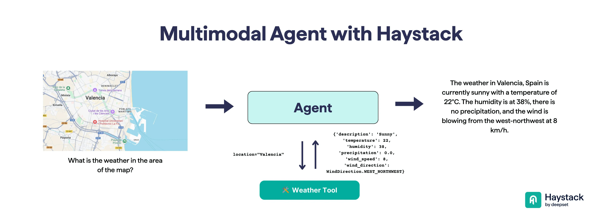

+++
title = "Haystack can now see 👀"
date = "2025-08-07"
description = "Image support landed in Haystack! Tutorials inside."

[taxonomies]
tags = ["multimodality", "LLM", "Haystack", "RAG", "Agents", "Tutorials"]
+++

<!-- toc -->

The 2.16.0 Haystack release adds a long-requested feature: **image support**!

This isn't just about passing images to an LLM. We built several features to enable practical multimodal use cases.

**What's new?**

- 🧠 Support for multiple LLM providers: OpenAI, Amazon Bedrock, Google Gemini, Mistral AI, NVIDIA, OpenRouter, Ollama and more
- 🎛️ Prompt template language to handle structured inputs, including images
- 📄 PDF and image converters
- 🧾 LLM-based extractor to pull text from images
- 🔍 Image embedders using CLIP-like models
- 🧩 Components to build multimodal RAG pipelines and Agents

I had the chance of leading this effort with Sebastian Husch Lee (great collab).

📓 Below you can find two notebooks to explore the new features:
- [Introduction to Multimodal Text Generation](https://haystack.deepset.ai/cookbook/multimodal_intro)
- [Creating Vision+Text RAG Pipelines](https://haystack.deepset.ai/tutorials/46_multimodal_rag)

(🖼️ image by Bilge Yücel)

