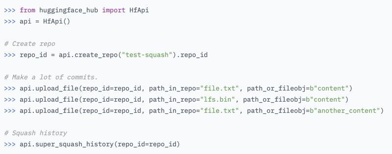

+++
title = "🧰 Free up space on the Hugging Face Hub with `super_squash_history` 🧹"
date = "2025-06-30"

[taxonomies]
tags = ["Hugging Face", "tips"]
+++

The Hugging Face Hub is the home of machine learning models and datasets.
They provide free storage for public repos.
For private repositories, there are limits: 100 GB for free users and 1 TB for PRO users.

This weekend I did some cleanup on my private repos

I went from 1.58 TB down to 1 GB. 😅

Besides deleting old, unused models, the main tool I used was a lesser-known command:
[`super_squash_history`](https://huggingface.co/docs/hub/en/storage-limits#super-squash-your-repository-using-the-api).

When you train a model, you often push multiple checkpoints to the Hub.

Each checkpoint = a commit.

A 2.6B model in BF16 is ~5 GB.

So 10 checkpoints = 50 GB. That adds up fast.

While full commit history can be useful for rollbacks, it's often unnecessary for older experiments where only the final model matters.

In these cases, you can use super_squash_history: it reduces your entire repo history to a single commit.

⚠️ super_squash_history is a non-revertible operation. Once squashed, the commit history cannot be retrieved.

Hope this is useful to others.

