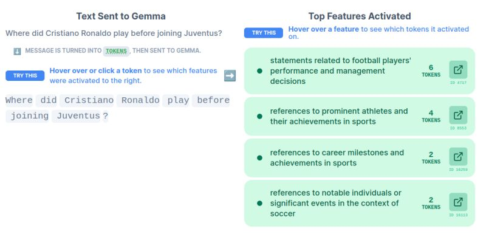

+++
title = "🤔 What does a LLM think when it thinks?"
date = "2024-08-01"
description = "Introduction to mechanistic interpretability of LLMs."

[taxonomies]
tags = ["LLM", "interpretability", "Gemma", "notes"]
+++

<!-- toc -->

Yesterday's Gemma release was big!

Not only because the 2B model surpasses GPT-3.5-Turbo in the Chatbot Arena...

Deepmind folks also released Gemma Scope, which opens new doors in LLM interpretability.

## 📝 Mechanistic interpretability recap

🔹 When you ask an LLM a question, your text is turned into a series of activations that map the relations between words.

🔹 These activations, at different layers in the model's neural network, represent increasingly complex concepts, called features.

⛔ Researchers face a key challenge: the model's activations mix many different features together.

⛔ Features do not match individual neurons.

💡 This is where **sparse autoencoders** come in. They can be trained for each layer/sublayer to identify a small number of significant features for each activation.
(Remember Golden Gate Claude? 🌉)

## 💎 Gemma Scope
Google DeepMind trained sparse autoencoders for every layer and sublayer output of Gemma 2 2B and 9B.

Gemma Scope is a collection of over 400 sparse autoencoders with more than 30 million learned features.

You can easily use these to investigate and inspect the inner behavior of the LLM.

Comes with an interactive demo and a Colab notebook! 📓

## 📚 Resources

### Theory
- [Introduction to Sparse Autoencoders for LLM interpretability (by Adam Karvonen)](https://adamkarvonen.github.io/machine_learning/2024/06/11/sae-intuitions.html)
- [Scaling monosemanticity - with Golden Gate experiment (by Anthropic)](https://transformer-circuits.pub/2024/scaling-monosemanticity/index.html)

### 💎 Gemma Scope
- [Blog post](https://deepmind.google/discover/blog/gemma-scope-helping-the-safety-community-shed-light-on-the-inner-workings-of-language-models/)
- [Technical report](https://storage.googleapis.com/gemma-scope/gemma-scope-report.pdf)
- [Interactive demo](https://www.neuronpedia.org/gemma-scope)
- [Colab notebook](https://colab.research.google.com/drive/17dQFYUYnuKnP6OwQPH9v_GSYUW5aj-Rp)