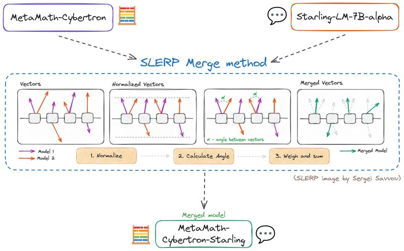

+++
title = "🧩🧩 Merging Language Models: what I've learned"
date = "2024-02-05"

[taxonomies]
tags = ["model merging", "notes", "LLM"]

+++

<!-- toc -->

Merging LLMs is a recent trend in the AI community, with merged models taking the top ranks in Language Models leaderboards.
Using [mergekit](https://github.com/arcee-ai/mergekit), merging LLMs is easy and you don't even need a GPU!

But how does it work?

## Why merging models?
Traditionally, models are fine-tuned to acquire new capabilities - a process demanding time and resources.

Model merging allows combining the capabilities of two (or more) existing models, without fine-tuning.

It is possible, for example, to combine two 7B models (one good at conversation 💬, the other good at math 🧮) to make a single 7B model with similar abilities to the original models.

## ⚙️ What happens under the hood?
We often think of a Generative Language Model as a text-generation machine.

We can also see it as a neural network: a matrix of weights (scalars) + activation functions.

Model merging manipulates these weights mathematically/geometrically without training.

## 🛠️ Techniques
- The simplest approach involves merging models by computing a weighted average of their weights -> Model soups 🥣

- SLERP (Spherical Linear Interpolation) is a more advanced interpolation method that ensures better preservation of distinct characteristics from the original models.
This method is very popular and has been used to create SOTA merged models!

- The ["Editing Models with Task Arithmetic" paper](https://arxiv.org/abs/2212.04089) introduced the concept of "task vector": the vector associated with a specific task/capability.
It is obtained by subtracting the weights of a pre-trained model from the weights of the same model after fine-tuning.

By manipulating these task vectors through addition or subtraction, more targeted model merges become feasible.

Recent techniques like TIES and DARE build upon the Task Arithmetic framework, enabling the merging of a larger number of models while retaining their strengths.

## 🔮 Looking ahead
Merging LLMs seems promising, allowing the production of good models quickly and inexpensively. 
Charles Goddard, the creator of mergekit, has recently joined Arcee AI (quite active in the area of Small Language Models) and I expect progress in this field...

## 📚 Resources
Check out these great blog posts:
- [Merge Large Language Models with mergekit](https://mlabonne.github.io/blog/posts/2024-01-08_Merge_LLMs_with_mergekit.html) by Maxime Labonne
- [Merge Large Language Models](https://slgero.medium.com/merge-large-language-models-29897aeb1d1a) by Sergei Savvov

Also Omar Sanseviero recently experimented with these techniques.
- 🧪 [Recap](https://huggingface.co/posts/osanseviero/691474247332404)
- 📖 [Collection of papers](https://huggingface.co/collections/osanseviero/model-merging-65097893623330a3a51ead66)

