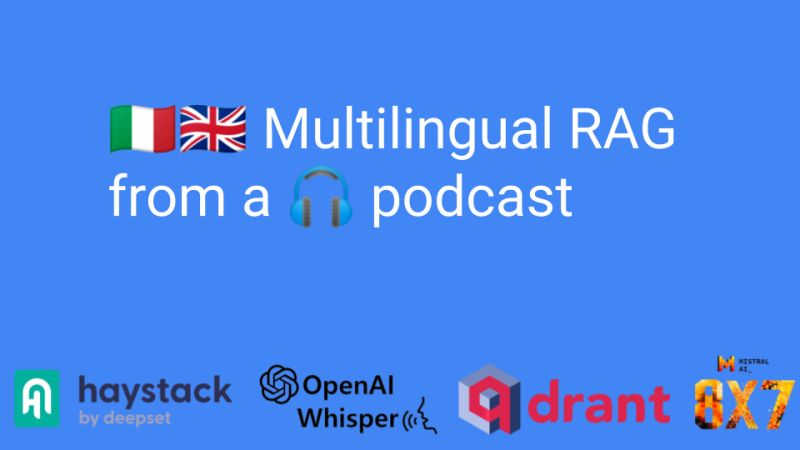

+++
title = "🇮🇹🇬🇧 Multilingual RAG from a 🎧 podcast"
date = "2024-01-03"
description = "Learn how to build a multilingual RAG pipeline based on a podcast episode transcript"

[taxonomies]
tags = ["Tutorials", "LLM", "Haystack", "RAG", "Qdrant", "Mistral", "Whisper", "multimodality", "multilingual"]
+++
<!-- toc -->

## Idea
Happy new year, LLM aficionados!

A few weeks ago [Sara Zanzottera and I were interviewed on the PointerPodcast](../haystack-podcasts).
We talked about LLMs, open-source, RAG... It was a blast!
Unfortunately, you can only enjoy it if you know Italian...

🧪 So I came up with an experimental idea: create a multilingual RAG app based on that podcast.
This means you can pose questions in English and receive responses in English, even if the original content is in Italian.

## 🧰 The open-source stack
- Haystack LLM orchestration framework, to build indexing and RAG pipelines
- Whisper model for transcribing audio into text
- Qdrant vector database to efficiently store and search embeddings corresponding to different chunks
- intfloat/multilingual-e5-large: a good multilingual embedding model
- Mixtral 8x7B Instruct-v0.1: the powerful multilingual mixture of experts model

**📒 Explore the [notebook](https://haystack.deepset.ai/cookbook/multilingual_rag_podcast)**

## 📎 Findings
Although the transcription does not have excellent quality (I used Whisper small), the application works quite well.

Mixtral can easily handle information in Italian and use it to formulate answers in English, without an intermediate translation step.

