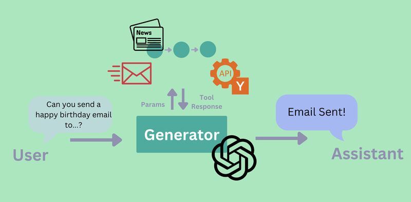

+++
title = "Create a 📰 Newsletter Agent with Haystack Tools 🛠️"
date = "2024-10-17"
description = "Learn how to create an Agent that can fetch information, write a newsletter for a specific audience and send it."
[taxonomies]
tags = ["Tutorials", "LLM", "Agents", "Tool Calling", "Haystack"]
+++

In the Haystack framework, we've recently implemented unified Tool Calling support across different model providers.

In the following resources, we'll walk through building a Newsletter Agent using three tools:
- A tool to fetch top stories from Hacker News
- A tool to create newsletters for a particular audience
- A tool to send emails via Gmail.

**Resources**
- [📓 Notebook](https://haystack.deepset.ai/cookbook/newsletter-agent)

- 🎬 Video: {{ youtube(id="QWx3OzW2Pvo") }}