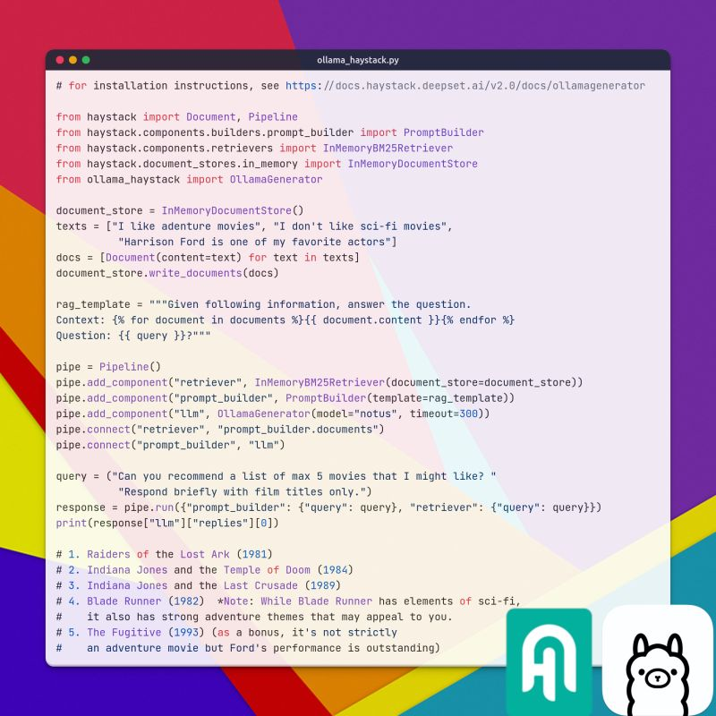

+++
title = "🦙 Ollama lands in the Haystack ecosystem"
date = "2024-01-09"

[taxonomies]
tags = ["Tutorials", "LLM", "Haystack", "Ollama"]
+++

🎉 Today I'm very happy to announce the integration between the Haystack LLM orchestration framework and the Ollama project.

Ollama is the equivalent of 🐳 Docker for LLMs:
a smart and easy way to pack and run quantized LLMs everywhere, even in cheap laptops (wo GPUs).

This integration, driven by community demand, was also implemented by the community:
thanks Alistair Rogers and Sachin Sachdeva! 🙌

🍿🎬 In the image, I am seeking movie suggestions from the great Notus 7B model (by Argilla 💕).

## 📚 Resources
- [Haystack-Ollama integration page](https://haystack.deepset.ai/integrations/ollama)
- [Haystack-Ollama docs](https://docs.haystack.deepset.ai/docs/ollamachatgenerator)
- [Video tutorial by Mervin Praison](https://www.youtube.com/watch?v=8qqaqefugWQ)