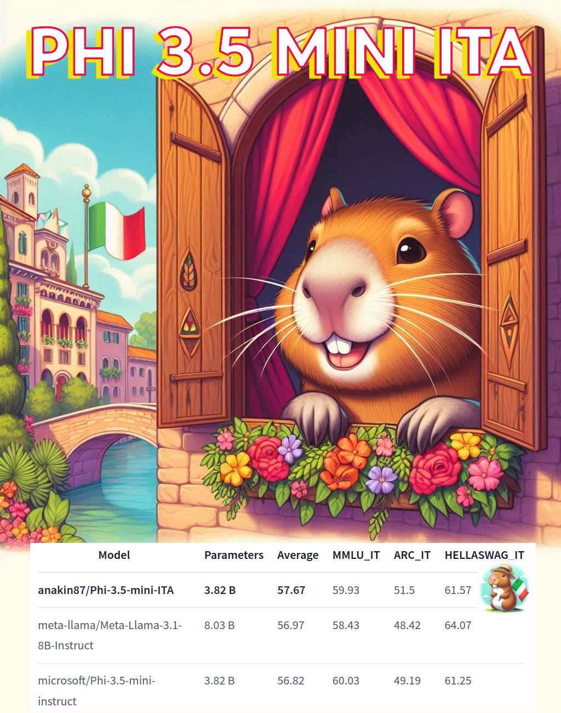

+++
title = "💬🇮🇹 Phi 3.5 mini ITA: my Italian Small Language Model"
date = "2024-08-29"
description = "Combine RAG on a knowledge base with Web Search to intelligently answer user questions."

[taxonomies]
tags = ["LLM", "Fine-tuning", "Spectrum", "Italian"]
+++

<!-- toc -->

## Intro
Lately, I've spent some time fine-tuning language models.

Now I am happy to release Phi 3.5 mini ITA: a fine-tuned version of Phi-3.5-mini-instruct to improve performance on the Italian language

- Small (3.82 B parameters) but capable model
- 128k context length

📊 Vibe check and performance on Italian benchmarks seem encouraging

## 💬 Resources
- [Chat with it on 🤗 Spaces](https://huggingface.co/spaces/anakin87/Phi-3.5-mini-ITA)
- [Model card](https://huggingface.co/anakin87/Phi-3.5-mini-ITA)

- [📔 👣 Full training walkthrough](https://huggingface.co/blog/anakin87/spectrum)

## 🗃️ Data
Supervised fine-tuning using a good mix of English and Italian data:
- [FineTome-100k by Maxime Labonne](https://huggingface.co/datasets/mlabonne/FineTome-100k)
- [Capybara-Claude-15k-ita by Edoardo Federici](https://huggingface.co/datasets/efederici/Capybara-Claude-15k-ita)

🙏 Thanks to the authors for the datasets.

## 🎯 Targeted training with Spectrum

I used Spectrum, a relatively new technique for parameter-efficient learning.

The idea is to train only the layers of the model with high Signal-to-Noise Ratio (SNR) and ❄️ freeze the rest.
I trained the top 30% of model layers.