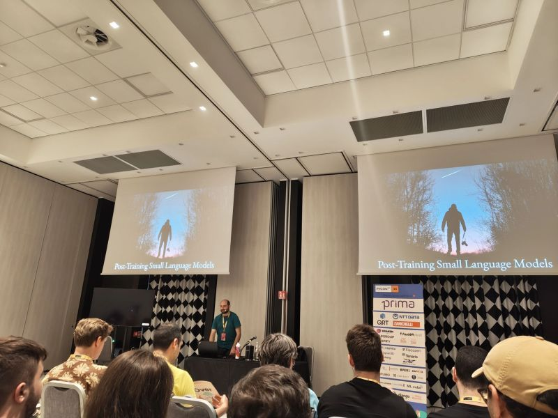
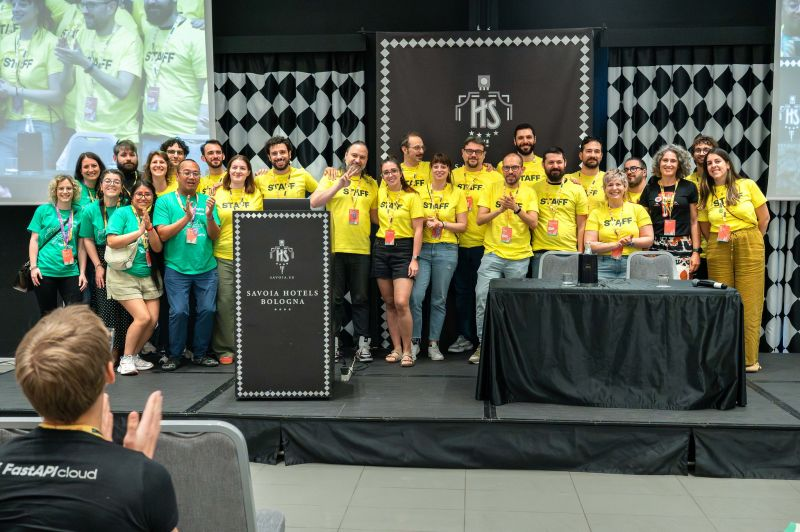

+++
title = "🐍 My adventure at PyCon Italy 2025"
date = "2025-06-24"

[taxonomies]
tags = ["Pycon", "talk", "LLM", "Small Language Models", "fine-tuning", "post-training"]

+++

3 weeks ago I had a great time at PyCon Italia!

As always, the conference was full of sound technical content.

But above all, I came home with a sense of belonging and community.
I enjoyed the friendly and welcoming environment we participants found and contributed to.
🙏 Thanks to the organizers and volunteers who made it possible.

I loved talking with old and new friends: Luca Corbucci, Michele Pangrazzi, Sara Callaioli, Tommaso Radicioni, David Berenstein, Simona Mazzarino, Luca Gilli, Edoardo Abati, and many others.

I also gave a talk on Fine-tuning Small Language Models.
I covered:
- 👣 Common techniques (SFT and DPO)
- ⚙️💰 Memory-efficient training (QLoRA, Spectrum)
- 🧩 Model merging
- 🧠💭 Reasoning models and GRPO
- 📱 Running small Language Models on a phone

**Post-Training Small Language Models: the adventures of a practitioner**
- 🍿 [Video](https://www.youtube.com/live/yOIV-1qtwcU?si=bvzkCxlgnrZG_yq8&t=19889)
- 🧑‍🏫 [Slides and resources](https://github.com/anakin87/posttraining-small-language-models-talk)

