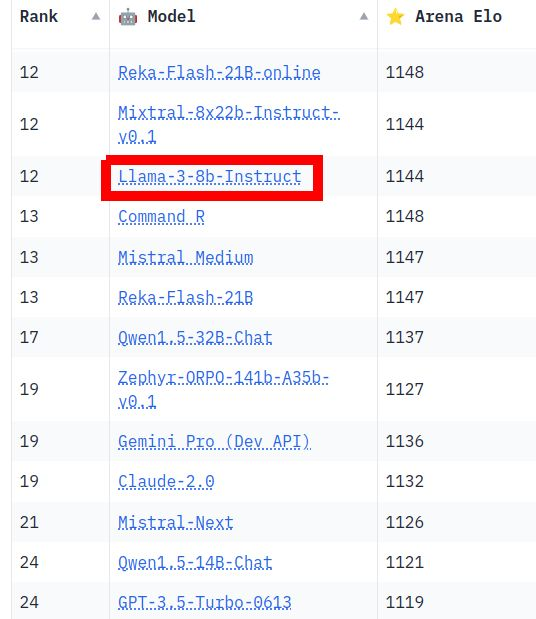

+++
title = "Playing with 🦙 Llama 3 - RAG about Oscar night 🎬"
date = "2024-04-19"

[taxonomies]
tags = ["Tutorials", "LLM", "RAG", "Llama", "Haystack"]
+++

What I find great about the new Llama 3 models is that
the small 8B instruct variant outperforms larger proprietary models such as GPT-3.5-Turbo-0613
in the [🏆 LMSYS Chatbot Arena](https://lmarena.ai/?leaderboard) (crowdsourced human evaluation)!

Ofc, you can build with Llama 3 in the Haystack LLM framework from day one 😎

**RAG about Oscar night 🏆🎬**

Stack: Haystack + Snowflake Arctic embeddings + Llama3

[📓 Notebook](https://haystack.deepset.ai/cookbook/llama3_rag)
