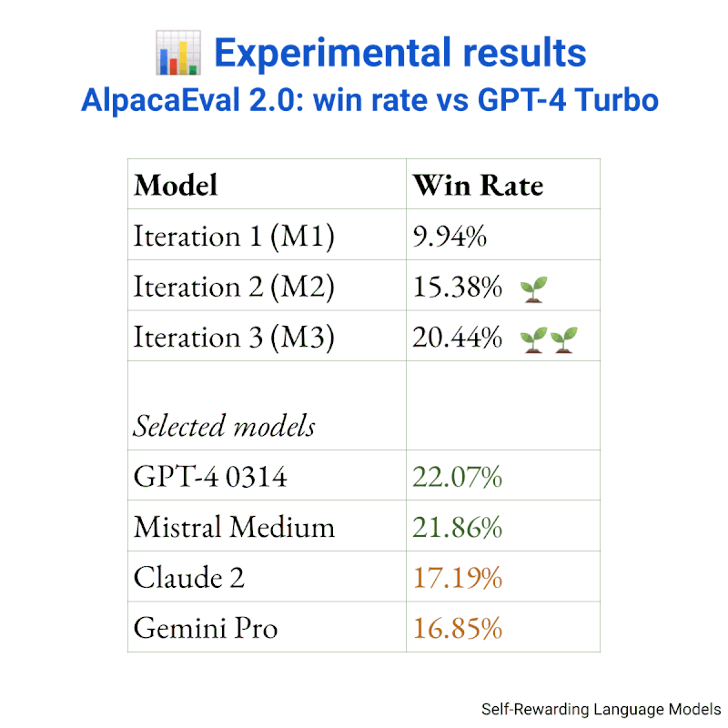

+++
title = "Can Language Models self-improve? 🏋️📈"
date = "2024-01-22"
description = "Notes on the Self-Rewarding Language Models paper"

[taxonomies]
tags = ["LLM", "paper", "notes", "fine-tuning", "DPO"]
+++

<!-- toc -->

## Intro
Can Language Models self-improve?

A [recent paper](https://arxiv.org/abs/2401.10020) by Meta and NYU also tackles this topic and the answer is:
yes, to some extent.

In "Self-Rewarding Language Models", they propose a novel iterative training approach.

Let's briefly recall the **common approach to train LLMs**:
- Start with a pretrained base Language Model, capable of generating text but not following instructions.
- Supervised Fine-Tuning (SFT): train the base model on an instruction dataset.
- Alignment to human preferences: further train the model using (human or AI) preference data.
This step can be performed with RLHF or simpler techniques like Direct Preference Optimization (DPO)

## 📑 Self-Rewarding Language Models

0. Start from a base model (Llama 2 70B) -> Model M0
1. Warm start: train the base model (SFT) using the Open Assistant dataset -> Model M1
    - Notably, Evaluation Fine Tuning data is used to teach the model to act as a Judge.
 
2. Self-Instruction creation 💡

    - given new prompts (generated with the Self-Instruct approach), Model M1 generates candidate responses.
    - Model M1 evaluates the candidate responses (LLM-as-a-Judge approach).
3. AI Feedback Training: the generated preference pairs are used to train Model M1 via DPO -> Model M2

🔄 Repeat steps 2 and 3

## 📊 Experimental results
- 🌱🌱 The trained models exhibit progressively stronger capabilities in both instruction following and self-rewarding.
- 📈 the M3 Model strongly outperforms previous iterations on AlpacaEval 2.0
- 🏆 the M3 Model shows good overall performance on AlpacaEval 2.0: its win rate vs GPT-4 Turbo is on par with larger proprietary models

🔮 Despite the limitations highlighted in the paper, IMHO this is an interesting and promising direction!

