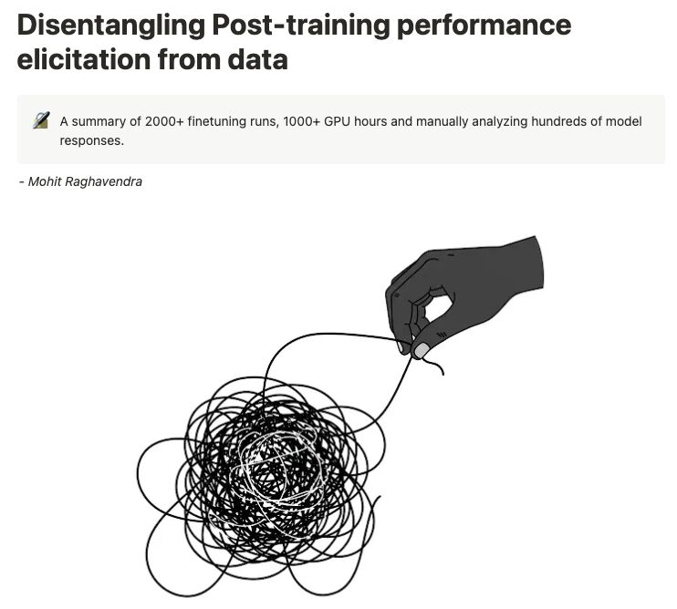

+++
title = "Supervised Fine-Tuning vs Preference Alignment: Who does what in Post-Training?"
date = "2025-06-05"

[taxonomies]
tags = ["LLM", "fine-tuning", "post-training", "Reinforcement Learning", "paper"]

+++

After pretraining a Language Model, you get a base model, powerful and rich in linguistic knowledge, but with several hidden capabilities.

For example, it is good at completing text but does not reliably follow instructions. ❌ 

Before using the model in applications, you need to apply 𝗣𝗼𝘀𝘁-𝗧𝗿𝗮𝗶𝗻𝗶𝗻𝗴.

This involves several steps and techniques, including Supervised Fine-Tuning (**SFT**), Preference Alignment (with **PPO** or **DPO**), Reinforcement Learning with Verifiable Rewards (often using **GRPO**).

If you've looked into Post-Training, you've probably wondered (like I did):

> What does each of these techniques do to the final model? 🤔

One great resource on this is the article 🧶 ["Disentangling Post-training performance elicitation from data" by Mohit Raghavendra](https://mohit-raghavendra.notion.site/Disentangling-Post-training-performance-elicitation-from-data-1a5db7f2a34480e18010d689a1f46f74).

📝 TL;DR from the article

Base Models are bad at reasoning in the response space.
A small amount of SFT initially aligns the model’s response distribution to the required multistep reasoning style - it imparts it the ability to do reasoning, even if it isn’t necessarily always correct.
Further SFT is useful, but the data curation is expensive, when compared to marginal improvements gains.
Preference finetuning on the other has a weaker per-sample reward signal, which is why many models resort to large-scale RL tuning. However, starting from an SFT checkpoint improves RL sample efficiency, by using the (weaker) reward signal to improve on the reasoning accuracy rather than the style, since it doesn’t have to stray too far from the response model distribution and incur a KL penalty.

