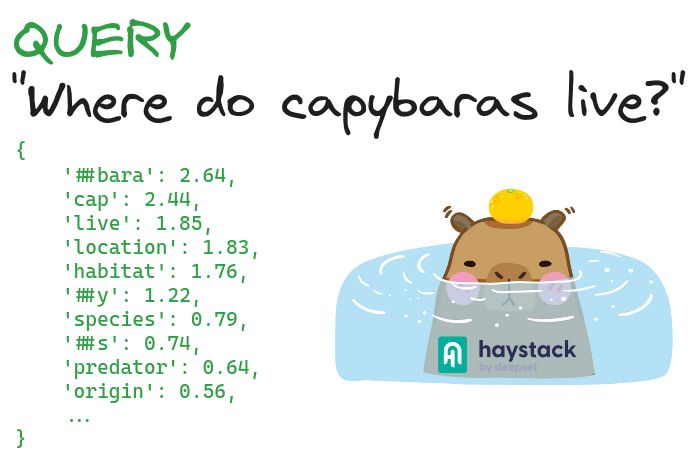

+++
title = "🔎 Sparse Embedding Retrieval in Haystack"
date = "2024-04-29"
description = "Learn how to use SPLADE for better retrieval with Haystack + Qdrant"

[taxonomies]
tags = ["Tutorials", "Haystack", "Qdrant", "SPLADE", "FastEmbed", "Information Retrieval", "RAG"]
+++

Keyword-based retrieval methods like BM25 are efficient but lack semantic understanding.

On the other hand, dense vector retrieval requires considerable computational resources and may struggle in new domains.

💡 [SPLADE](https://github.com/naver/splade), a sparse embedding retrieval technique, tries to combine the strengths of both methods.

Leveraging Language Models like BERT, SPLADE evaluates the relevance of query terms and performs automatic term expansion.

For a deep and visual overview of SPLADE, check out [this article by Pinecone and James Briggs](https://www.pinecone.io/learn/splade/).

SPLADE is promising and we are happy to introduce this technique into the Haystack LLM framework! 🎉
This integration features:
- FastEmbed Sparse Embedders
- new Qdrant retrievers.

This integration owes much to the dedication of our community member Corentin Meyer 👏 and to the help of Qdrant folks 🙌.

🙏 A special mention also goes to Prithivi Da, who created an industry-ready SPLADE model with a permissive license.

Curious to see SPLADE in action? Check out the notebook 👇
[📓 Sparse Embedding Retrieval with Qdrant and FastEmbed](https://haystack.deepset.ai/cookbook/sparse_embedding_retrieval)