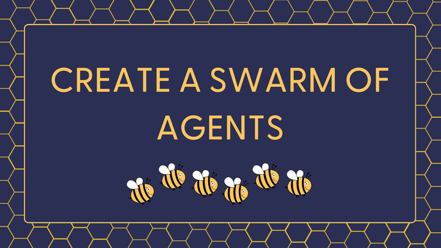

+++
title = "🐝🐝🐝 A Swarm of Agents with Llama 3.2, GPT-4o mini and Claude 3.5 Sonnet"
date = "2024-11-26"
description = "Learn how to reimplement OpenAI Swarm and make it work with both open and proprietary models."

[taxonomies]
tags = ["Tutorials", "LLM", "Agents", "Haystack", "Tool calling", "Swarm"]
+++

**TL;DR**: I reimplemented the Swarm concept using Haystack, but made it work with both open and proprietary models 💫

[✍️ Blog article](https://haystack.deepset.ai/blog/swarm-of-agents) - [📓 Notebook](https://haystack.deepset.ai/cookbook/swarm)

For a short intro, read on!


Some time ago OpenAI published Swarm: an educational framework for building multi-agent systems.

Their approach focuses on two main concepts:
- **Routines**: Each agent follows specific 📜 instructions and uses 🛠️ tools to execute them.
- **Handoffs** 🤝: Agents can transfer control to one another using tool/function calling.

When I first read these ideas, I thought: *simple but powerful!* And they pair well with the recent unified tool support in Haystack.

🧑‍💻 So, I decided to re-implement these concepts using Haystack, and in just a few lines of code, I had a working prototype.

🆒 Bonus feature: this implementation isn't tied to a single model provider - different agents can be powered by different models! 

I replicated the ACME customer service example from the original article, with 3 Agents:
- 🐝 Triage Agent - Llama 3.2 running on Ollama
- 🐝 Sales Agent - Anthropic Claude 3.5 Sonnet
- 🐝 Issues and Repairs Agent - OpenAI GPT-4o mini

Want to see the full implementation and give it a try? 👇
- [✍️ Haystack blog article](https://haystack.deepset.ai/blog/swarm-of-agents)
- [📓 Notebook](https://haystack.deepset.ai/cookbook/swarm)

