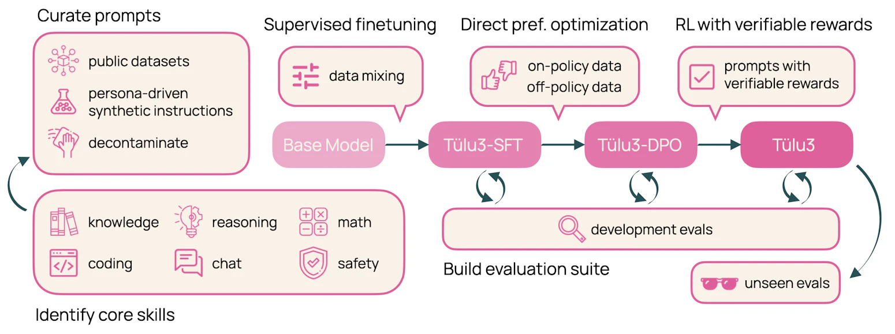

+++
title = "Tülu 3: a massive work in open LM post-training"
date = "2024-11-21"

[taxonomies]
tags = ["LLM", "post-training"]
+++

🚨 Ai2 just published a massive work on **Post-training Language Models**
and they've made everything completely **public and reproducible**!

**What is post-training?**

It's what happens after pre-training to make a model truly usable:
instruction tuning, alignment to human preferences with different techniques, etc.

Completely Public efforts in this space have been rare - like [Zephyr by Hugging Face](https://huggingface.co/collections/HuggingFaceH4/zephyr-7b-6538c6d6d5ddd1cbb1744a66). But Tülu 3 is big step forward.

AllenAI's latest collection of SOTA models, Tülu 3, is fine-tuned from Llama 3.1.

The release includes:
- models
- data
- training and evaluation code
- a detailed (and impressive) technical report

They are also introducing a new technique: *Reinforcement Learning on Verifiable Rewards*.

👏 Kudos to Nathan Lambert and team!

**Resources**:
- [AllenAI blog post](https://allenai.org/blog/tulu-3-technical)
- [Technical report](https://arxiv.org/abs/2411.15124)
- [Blog post by Nathan Lambert](https://www.interconnects.ai/p/tulu-3)

