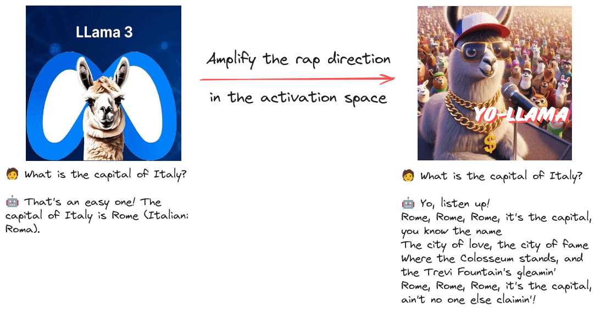

+++
title = "🎤 yo-Llama 🦙: a model that raps"
date = "2024-07-01"
description = "Alter the behavior of a LLM by amplifying a feature direction in the activation space"

[taxonomies]
tags = ["Tutorials", "LLM", "interpretability", "Llama"]
+++

<!-- toc -->

## How to alter the behavior of a Language Model without fine-tuning or prompting?

Say hello to 🎤 yo-Llama 🦙! -> [Model on HF 🤗](https://huggingface.co/anakin87/yo-Llama-3-8B-Instruct)

This experiment steers Llama-3-8B-Instruct to respond in a rap style.

How? Amplifying the rap direction in the activation space. 😎

## What sparked this idea?

Lately, I got interested in mechanistic interpretability of LLMs.

💡 A recent paper, ["Refusal in Language Models Is Mediated by a Single Direction"](https://arxiv.org/abs/2406.11717), showed how to find the refusal direction in the activation space of Chat Language Models and either erase or amplify it.
A clever jailbreak method for open weights models.

Then, Failspy took it a step further by modifying the models to amplify different traits, such as making a model seem grumpy or irritable.

## How did I create yo-Llama?

([📓 Notebook](https://huggingface.co/anakin87/yo-Llama-3-8B-Instruct/blob/main/steer_llama_to_rap_style.ipynb), heavily inspired by Failspy's work)

1. Load the Llama-3-8B-Instruct model.
2. Load 1024 examples from Alpaca (instruction dataset).
3. Prepare a system prompt to make the original model act like a rapper.
4. Run inference on the examples, with and without the system prompt, and cache the activations.
5. Compute the rap feature directions (one for each layer) from the activations.
6. Apply the feature directions one by one, checking the results on some examples.
7. Pick the best-performing feature direction.
8. Apply this feature direction and voilà!
yo-Llama-3-8B-Instruct is born! 🥳🎶

This was a fun experiment. 

## 📚 Resources

- [Refusal in Language Models Is Mediated by a Single Direction](https://arxiv.org/abs/2406.11717)

- [Uncensor any LLM with abliteration](https://huggingface.co/blog/mlabonne/abliteration): great practical blog post by Maxime Labonne

- Practical materials by Failspy:
  - [abliterator library](https://github.com/FailSpy/abliterator)
  - [Llama-MopeyMule-3-8B-Instruct model](https://huggingface.co/failspy/Llama-3-8B-Instruct-MopeyMule)
  - [Induce Melancholy notebook](https://huggingface.co/failspy/Llama-3-8B-Instruct-MopeyMule/blob/main/MopeyMule-Induce-Melancholy.ipynb)