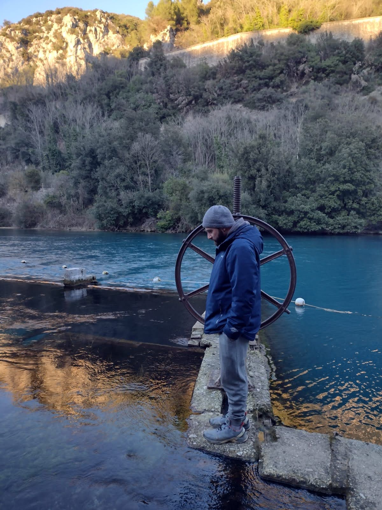

+++
title = "About"
template = "info-page.html"
path = "about"
+++

👋 Hey! I am Stefano Fiorucci.

I've always been passionate about coding since childhood. After studying 🏗️ Civil Engineering, I switched to Machine Learning.

🏄🏻‍♂️ In my career so far, I've navigated between **Software Engineering**, Information Retrieval, and Natural Language Processing. These days, my main focus is on **Language Models**: training (SFT, GRPO...), orchestration (RAG, Agents, ...), syntethic data.

🤝 I care deeply about **open source** and enjoy contributing, whether through code or by training Small Language Models. Similarly, **sharing what I learn** and build over time feels natural to me: I like creating tutorials and demos, sharing things on social media, and occasionally giving talks...

👨‍💻 Currently, I work at deepset, contributing to [Haystack](https://github.com/deepset-ai/haystack), an open-source LLM framework.
My key contributions include unified Tool support (foundational for Agents), image capabilities, faster imports, and CI speed-ups. I also curate Haystack's integration ecosystem: Hugging Face, FastEmbed, Ollama, pgvector, Pinecone, Qdrant, Unstructured, and more. I love collaborating with the DevRel team to create tutorials and recipes that showcase practical use cases and help users.

In my **spare time**, I love taking meditative walks 🚶, dedicating myself to social volunteering ⭐, and exploring creativity through theater, music, books, and movies 🎨.

To know more about my professional experience, check out [my LinkedIn](https://www.linkedin.com/in/stefano-fiorucci/).
Curious about what I build? Visit my [GitHub](https://github.com/anakin87) and [Hugging Face](https://huggingface.co/anakin87) profiles.

